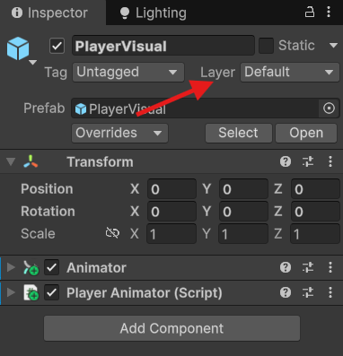

## Goal
Implement a basic forward interaction system using Raycast and LayerMask,
while preparing for a future interface-based interaction design.

### Handle Interaction

>The Idea is we can use `Physics.Raycast` to shoot a ray from players position towards the player direction to specified distance and get the information about the object from the raycast.

1. Implement a private method to handle player interaction named `HandleInteraction()`, ==Later we could move this to separate script which handle interaction==.
2. Perform a raycast using `Physics.Raycast(Vector3 origin, Vector3 direction, out RaycastHit hitInfo, raycastDistance)`, this function returns a `true` if hit something, else `false`.
3. origin should be `trasnform.position`, direction should be `MovementDirection()`.
4. `out RaycastHit hitinfo` *it is an structure used to get raycast information back from raycast.*
5. ex . `if (Physics.Raycast(transform.position, MovementDirection(), out RaycastHit hitInfo, raycastDistance))   Debug.Log("Hit: " + hitInfo.collider.name);`
6. Now there is an error when we use `MovementDirection()` it only detects direction if player is moving e.g. `Vector3 movementDirection = new Vector3(movementInput.x, 0, movementInput.y)`
7. If not moving in any direction the this vector will be (0,0,0).
8. So, to avoid this we just need to store last `movementDirection` when not moving we can do by checking with if statement ex. `if (interactionDirection != Vector3.zero)   lastInteractDirection = interactionDirection;
9. Then We can use this in `Physics.Raycast` ex. `(Physics.Raycast(transform.position, lastInteractDirection, out RaycastHit hitInfo, raycastDistance)`.
10. Now Create a new Script for the Game Object which we want to interact with and attach it to the `Prefabs` which player wants to interact with.
	>==*NOTE : This interaction is temporary we will later add Interfaces for interaction with the object*.===
11. In the new script add an Interact method i.e. `Interact()`
12. Now in player class in `HandleInteraction()` method, we can check if the object the player Interacted is the same object to which we attached the script to. 
	 >==*Later we can simply check if the parent object has the interface *`IInteractable` *present or not.===
13. If the objects script found call the `Interact` in the object. ex. `clearCounter.Interact();` 
14. We Can also use layer mask to put Interactable objects on same layer so they can be accessed even if there is something in front.
### Setting Up Layer Mask

Open Inspector in Unity, and at top corner select Layer 

Now at bottom of the dropdown menu select add new layer option and create a new layer called `Interactable` now open up the prefab of the interactable Object ==Set the Layer== to Interactable.
Now in `Player.cs` Script add a `[SerializeField]` for `LayerMask` and assign it in Inspector in Editor.

Then in `HandleInteraction()` Method where we are implementing RayCast add the `LayerMask` as a last parameter
Ex. `Physics.Raycast(transform.position, lastInteractDirection, out RaycastHit hitInfo, raycastDistance, interactableLayerMask)`

> **LayerMask** *In Unity, a **LayerMask** is ==a data structure used to filter interactions between specific layers==, commonly in physics operations (like raycasts and collision checks) and camera rendering (culling masks). It is essentially a 32-bit integer where each bit corresponds to a specific layer number, allowing you to include or exclude multiple layers simultaneously.*

> **Layer Vs LayerMask**: 
> - A GameObject can be assigned to one **Layer** (an integer from 0 to 31). A **LayerMask** is a bitmask that can represent multiple layers. When an API function, such as `Physics.Raycast`, asks for a `LayerMask`, it checks which bits are set to 1 in the mask and interacts only with GameObjects on those corresponding layers.
>- **Purpose:** The primary use is to selectively ignore or include objects in an interaction, such as preventing a self-aimed raycast from hitting the player character, or having different cameras render different elements of a scene (e.g., a minimap camera).

