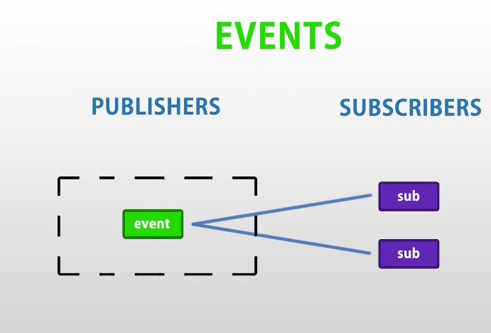

> This is an Introductory lesson on events and Delegates, we will do a deep dive on this topic in future when we will be comfortable with other unity features.

## Events :
An event is a mechanism for sending notifications from one object to another. It is declared in a class and is triggered when a specific action happens. Events rely on delegates to point to the method that will handle the occurrence.
****Syntax for Declaring an Event:****
` public event EventHandler EventName;`
#### Key points

- Events are declared using delegates.
- The event keyword restricts delegate access, allowing subscription (+=) and unsubscription (-=).
- Events support loose coupling between components.

i.e. in simple words, ==Events is way of saying if something happens without caring about who is listening or anyone==

    
- Publisher fires an *Event* if something happens, 
- Publisher Doesn't Care about if any Subscriber is listening to the event or using the event.
- **Events are used to separate the logic from Visual or to Decouple the code**.
-  It is a type of Observer - Subject model
	> Observer Design Pattern is a behavioral pattern that establishes a one-to-many dependency between objects. When the subject changes its state, all its observers are automatically notified and updated. It focuses on enabling efficient communication and synchronization between objects in response to state changes.
	
	****Note****: Subjects are the objects that maintain and notify observers about changes in their state, while Observers are the entities that react to those changes.

## Delegates :

In C#, a delegate is a type-safe function pointer that allows methods to be referenced and invoked dynamically. It provides a way to treat methods as objects, enabling scenarios such as event handling, callbacks and functional-style programming.
### Key Points
- A delegate defines the signature of methods it can point to.
- It can reference both static and instance methods.
- Delegates are type-safe, meaning the method signature must match the delegate declaration.
- They are the foundation of events and anonymous functions in C#.
### When to Use Delegates
- For implementing callbacks.
- For handling events.
****Syntax:****
`[modifier] delegate [return_type] [delegate_name]([parameter_list]);`

| Delegate                                                                                                           | Event                                                                                                                                                                                                                                                                                             |
| ------------------------------------------------------------------------------------------------------------------ | ------------------------------------------------------------------------------------------------------------------------------------------------------------------------------------------------------------------------------------------------------------------------------------------------- |
| Delegate is a function pointer. It holds the reference of one or more methods at runtime.                          | The event is a notification mechanism that depends on delegates                                                                                                                                                                                                                                   |
| Delegate is independent and not dependent on events.                                                               | An event is dependent on a delegate and cannot be created without delegates. Event is a wrapper around delegate instance to prevent users of the delegate from resetting the delegate and its invocation list and only allows adding or removing targets from the invocation list.                |
| Delegate includes Combine() and Remove() methods to add methods to the invocation list.                            | [EventInfo](https://docs.microsoft.com/en-us/dotnet/api/system.reflection.eventinfo?view=netframework-4.8) class inspect events and to hook up event handlers that include methods AddEventHandler() and RemoveEventHandler() methods to add and remove methods to invocation list, respectively. |
| A delegate can be passed as a method parameter.                                                                    | An event is raised but cannot be passed as a method parameter.                                                                                                                                                                                                                                    |
| = operator is used to assigning a single method, and += operator is used to assign multiple methods to a delegate. | = operator cannot be used with events, and only += and -= operator can be used with an event that adds or remove event handler. These methods internally call AddEventHandler and RemoveEventHandler methods.                                                                                     |

> Delegates are essentially function containers, Delegates store one or more functions and Calls them when Delegates are triggers.
> It works by declaring a delegate template, which is essentially the type of value it will return and type of value it can receive.
> Then We will be able to store instance of delegate type to store and then trigger different functions.
> This works by setting a delegate to a function.

**Note  : ***Always Check if Delegate is not null to avoid Errors.*
